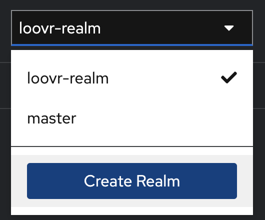
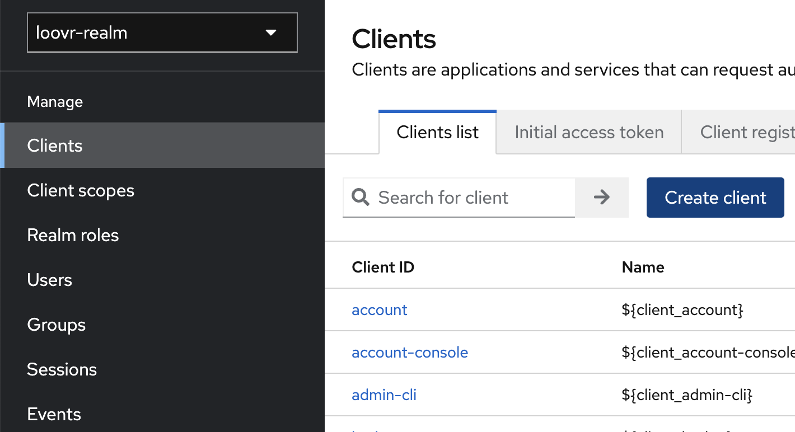
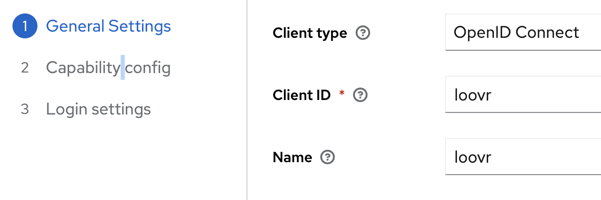
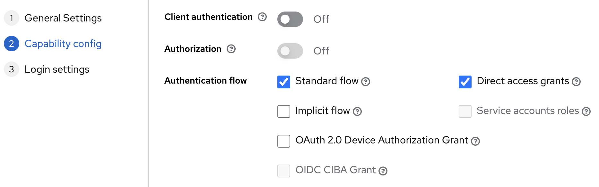
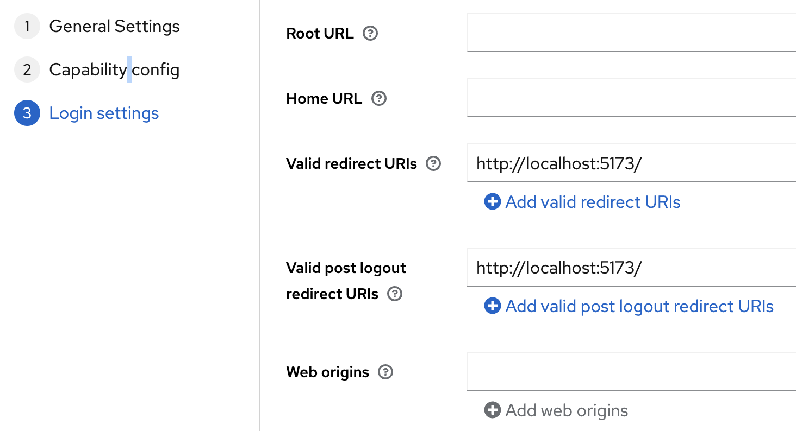
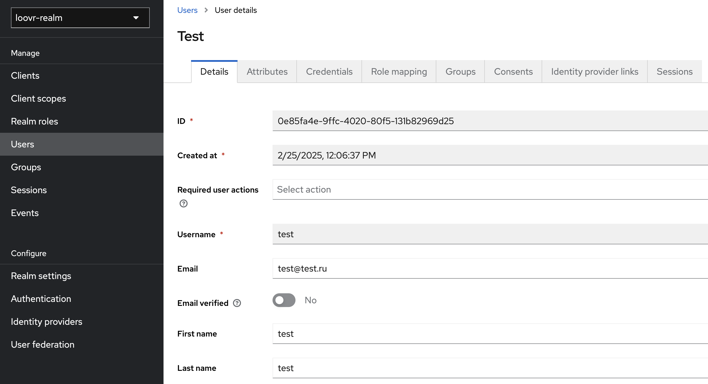

# Loovr backend: Keycloak Express App

## Как запустить?

1. Клонируем:

```bash
git clone https://github.com/DocDuck/loovr-backend
```

2. Создаем и конфигурирукм .env:

```dosini
# DB CONFIG
DB_HOST=postgres
DB_PORT=5432
DB_USER=loovr
DB_PASSWORD=loovr
DB_NAME=loovr

# KEYCLOAK
KEYCLOAK_URL=http://keycloak:8080
```

3. Запускаем прило в docker-compose:

```bash
docker-compose up --build
```

4. Создаем новый реалм в кейклоке

- Переходим в кейклок по адресу http://keycloak:8080
- Создаем реалм, например loovr-realm
  

5. Создаем новый клиент приложения в кейклоке
   
   
   
   

6. Добавляем тестового пользователя
   

7. TODO На фронте реализуем авторизацию кейклока используя эти настройки
